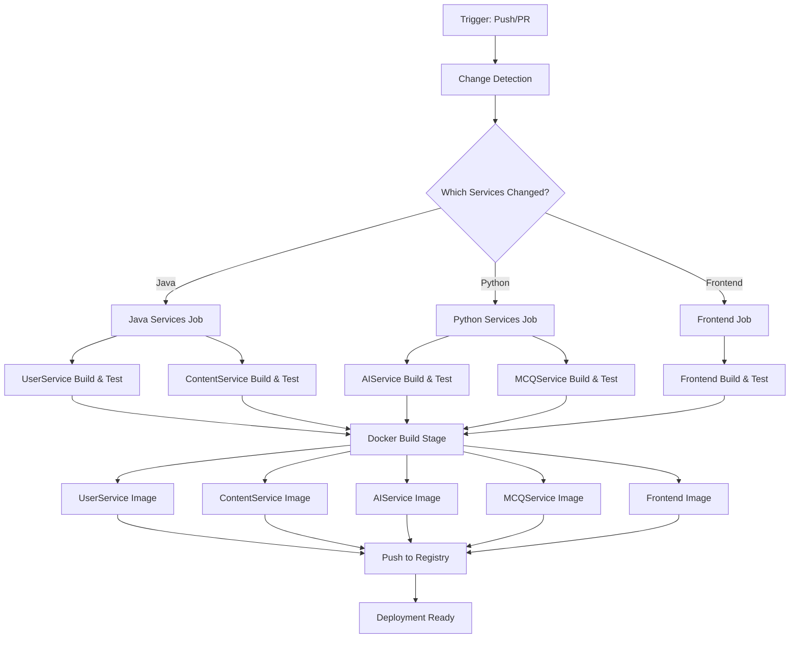
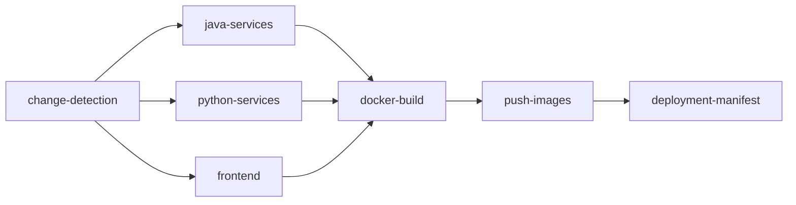

# Design Document: GitHub Actions CI/CD Pipeline

## Overview

This design specifies a GitHub Actions CI/CD pipeline for a multi-service application with 5 distinct services. The pipeline automates building, testing, and Docker image creation for Java (Spring Boot), Python (FastAPI), and React (Vite) services. The design emphasizes parallel execution, intelligent caching, and change detection to optimize build times while maintaining reliability.

The pipeline consists of three main workflow files:
1. **main-pipeline.yml**: Orchestrates the entire CI/CD process
2. **java-services.yml**: Reusable workflow for Java services
3. **python-services.yml**: Reusable workflow for Python services

## Architecture

### Workflow Structure



### Job Dependency Graph



### Parallel Execution Strategy

- **Phase 1 (Parallel)**: Change detection runs first
- **Phase 2 (Parallel)**: All service builds run concurrently (java-services, python-services, frontend)
- **Phase 3 (Parallel)**: Docker images build concurrently for services that passed tests
- **Phase 4 (Sequential)**: Push all images to registry
- **Phase 5 (Sequential)**: Generate deployment manifest

## Components and Interfaces

### 1. Change Detection Component

**Purpose**: Identify which services have code changes to optimize build execution

**Implementation**: Uses `tj-actions/changed-files` action

**Outputs**:
- `java_changed`: Boolean indicating if Java service code changed
- `python_changed`: Boolean indicating if Python service code changed
- `frontend_changed`: Boolean indicating if Frontend code changed
- `user_service_changed`: Boolean for UserService-specific changes
- `content_service_changed`: Boolean for ContentService-specific changes
- `ai_service_changed`: Boolean for AIService-specific changes
- `mcq_service_changed`: Boolean for MCQService-specific changes

**Path Patterns**:
```yaml
UserService: services/user-service/**
ContentService: services/content-service/**
AIService: services/ai-service/**
MCQService: services/mcq-service/**
Frontend: frontend/**
```

### 2. Java Services Build Component

**Purpose**: Build and test Java-based Spring Boot services

**Technology Stack**:
- Java 17
- Maven 3.8+
- Spring Boot 3.5.7

**Build Steps**:
1. Checkout code
2. Set up JDK 17 (Temurin distribution)
3. Cache Maven dependencies (~/.m2/repository)
4. Run `mvn clean verify` for each service
5. Upload test reports as artifacts

**Conditional Execution**: Only runs if `java_changed == true`

**Outputs**:
- `user_service_built`: Boolean indicating successful UserService build
- `content_service_built`: Boolean indicating successful ContentService build
- Build artifacts (JAR files)

### 3. Python Services Build Component

**Purpose**: Build and test Python-based FastAPI services

**Technology Stack**:
- Python 3.9+
- pip
- pytest

**Build Steps**:
1. Checkout code
2. Set up Python 3.9
3. Cache pip dependencies (~/.cache/pip)
4. Install dependencies: `pip install -r requirements.txt`
5. Run linting: `flake8` or `ruff`
6. Run tests: `pytest --cov`
7. Upload coverage reports as artifacts

**Conditional Execution**: Only runs if `python_changed == true`

**Outputs**:
- `ai_service_built`: Boolean indicating successful AIService build
- `mcq_service_built`: Boolean indicating successful MCQService build
- Test coverage reports

### 4. Frontend Build Component

**Purpose**: Build and test React frontend application

**Technology Stack**:
- Node.js 18+
- npm
- Vite
- React 19

**Build Steps**:
1. Checkout code
2. Set up Node.js 18
3. Cache node_modules
4. Install dependencies: `npm ci`
5. Run linting: `npm run lint`
6. Run tests: `npm test`
7. Build production bundle: `npm run build`
8. Upload build artifacts

**Conditional Execution**: Only runs if `frontend_changed == true`

**Outputs**:
- `frontend_built`: Boolean indicating successful frontend build
- Production build artifacts (dist/)

### 5. Docker Build Component

**Purpose**: Build Docker images for all services that passed their build and test phases

**Docker Build Strategy**:
- Use `docker/build-push-action@v5`
- Enable BuildKit for improved performance
- Use layer caching with GitHub Actions cache
- Build images in parallel using matrix strategy

**Matrix Configuration**:
```yaml
service:
  - name: user-service
    context: ./services/user-service
    dockerfile: ./services/user-service/Dockerfile
    condition: needs.java-services.outputs.user_service_built
  
  - name: content-service
    context: ./services/content-service
    dockerfile: ./services/content-service/Dockerfile
    condition: needs.java-services.outputs.content_service_built
  
  - name: ai-service
    context: ./services/ai-service
    dockerfile: ./services/ai-service/Dockerfile
    condition: needs.python-services.outputs.ai_service_built
  
  - name: mcq-service
    context: ./services/mcq-service
    dockerfile: ./services/mcq-service/Dockerfile
    condition: needs.python-services.outputs.mcq_service_built
  
  - name: frontend
    context: ./frontend
    dockerfile: ./frontend/Dockerfile
    condition: needs.frontend.outputs.frontend_built
```

**Tagging Strategy**:
- Main branch: `latest`, `sha-{GITHUB_SHA}`
- Feature branches: `{BRANCH_NAME}`, `sha-{GITHUB_SHA}`
- Pull requests: `pr-{PR_NUMBER}`, `sha-{GITHUB_SHA}`

**Conditional Execution**: Only builds images for services that successfully completed their build phase

### 6. Registry Push Component

**Purpose**: Authenticate and push Docker images to GitHub Container Registry

**Authentication**:
- Uses `GITHUB_TOKEN` for ghcr.io authentication
- Username: `${{ github.actor }}`
- Registry: `ghcr.io`

**Push Strategy**:
- Push all tags for each image
- Retry on transient failures (3 attempts)
- Verify image manifest after push

**Image Naming Convention**:
```
ghcr.io/{owner}/{repo}/{service-name}:{tag}
```

### 7. Deployment Manifest Component

**Purpose**: Generate a manifest file listing all built images with their tags for deployment

**Manifest Format** (JSON):
```json
{
  "build_id": "workflow-run-id",
  "commit_sha": "git-commit-sha",
  "branch": "branch-name",
  "timestamp": "ISO-8601-timestamp",
  "images": {
    "user-service": "ghcr.io/owner/repo/user-service:tag",
    "content-service": "ghcr.io/owner/repo/content-service:tag",
    "ai-service": "ghcr.io/owner/repo/ai-service:tag",
    "mcq-service": "ghcr.io/owner/repo/mcq-service:tag",
    "frontend": "ghcr.io/owner/repo/frontend:tag"
  }
}
```

**Artifact Storage**: Uploaded as workflow artifact named `deployment-manifest`

## Data Models

### Workflow Configuration Schema

**Main Pipeline Workflow**:
```yaml
name: CI/CD Pipeline
on:
  push:
    branches: ['**']
  pull_request:
    branches: [main, develop]
  workflow_dispatch:
    inputs:
      skip_tests:
        description: 'Skip test execution'
        required: false
        default: 'false'
      services:
        description: 'Comma-separated list of services to build (or "all")'
        required: false
        default: 'all'

env:
  REGISTRY: ghcr.io
  IMAGE_PREFIX: ghcr.io/${{ github.repository_owner }}/${{ github.event.repository.name }}

jobs:
  change-detection:
    # Job definition
  
  java-services:
    needs: [change-detection]
    if: needs.change-detection.outputs.java_changed == 'true'
    # Job definition
  
  python-services:
    needs: [change-detection]
    if: needs.change-detection.outputs.python_changed == 'true'
    # Job definition
  
  frontend:
    needs: [change-detection]
    if: needs.change-detection.outputs.frontend_changed == 'true'
    # Job definition
  
  docker-build:
    needs: [java-services, python-services, frontend]
    if: always() && !cancelled()
    # Job definition
  
  push-images:
    needs: [docker-build]
    # Job definition
  
  deployment-manifest:
    needs: [push-images]
    # Job definition
```

### Cache Key Schema

**Maven Cache**:
```
Key: ${{ runner.os }}-maven-${{ hashFiles('**/pom.xml') }}
Restore Keys: ${{ runner.os }}-maven-
```

**Pip Cache**:
```
Key: ${{ runner.os }}-pip-${{ hashFiles('**/requirements.txt') }}
Restore Keys: ${{ runner.os }}-pip-
```

**NPM Cache**:
```
Key: ${{ runner.os }}-node-${{ hashFiles('**/package-lock.json') }}
Restore Keys: ${{ runner.os }}-node-
```

**Docker Layer Cache**:
```
Key: ${{ runner.os }}-docker-${{ github.sha }}
Restore Keys: ${{ runner.os }}-docker-
```

### Service Build Output Schema

**Java Service Output**:
```json
{
  "service_name": "user-service",
  "build_status": "success|failure",
  "test_status": "passed|failed|skipped",
  "artifact_path": "target/*.jar",
  "test_report_path": "target/surefire-reports"
}
```

**Python Service Output**:
```json
{
  "service_name": "ai-service",
  "build_status": "success|failure",
  "test_status": "passed|failed|skipped",
  "coverage": "85.5",
  "test_report_path": "htmlcov/"
}
```

**Frontend Output**:
```json
{
  "service_name": "frontend",
  "build_status": "success|failure",
  "test_status": "passed|failed|skipped",
  "artifact_path": "dist/",
  "bundle_size": "2.5MB"
}
```

## Correctness Properties

*A property is a characteristic or behavior that should hold true across all valid executions of a system—essentially, a formal statement about what the system should do. Properties serve as the bridge between human-readable specifications and machine-verifiable correctness guarantees.*


### Property 1: Image tagging reflects branch context

*For any* commit on the main branch, all Docker images built should be tagged with both "latest" and the commit SHA. *For any* commit on a non-main branch, all Docker images built should be tagged with the branch name and the commit SHA.

**Validates: Requirements 4.2, 4.3, 4.4, 12.3, 12.4**

### Property 2: Change detection drives conditional execution

*For any* set of file changes in a commit, only the services whose source paths match the changed files should have their build jobs executed, and services with no matching changes should have their jobs skipped.

**Validates: Requirements 7.4, 7.5**

### Property 3: Docker images include build metadata labels

*For any* Docker image built by the pipeline, the image should contain metadata labels including at minimum: commit SHA, build timestamp, branch name, and workflow run ID.

**Validates: Requirements 5.5**

### Property 4: Deployment manifest completeness

*For any* successful pipeline execution, the generated deployment manifest should contain image references for exactly those services that successfully completed their build and test phases, and should not include services that failed or were skipped.

**Validates: Requirements 12.2, 12.5**

## Error Handling

### Build Failures

**Java Service Build Failures**:
- Maven compilation errors: Fail job immediately, display compiler output
- Test failures: Fail job, upload surefire reports as artifacts
- Dependency resolution failures: Fail job, display dependency tree

**Python Service Build Failures**:
- Dependency installation errors: Fail job, display pip error output
- Linting failures: Fail job, display linting violations
- Test failures: Fail job, upload pytest HTML report and coverage data
- Import errors: Fail job, display traceback

**Frontend Build Failures**:
- Dependency installation errors: Fail job, display npm error log
- Linting failures: Fail job, display ESLint violations
- Build errors: Fail job, display Vite build output
- Test failures: Fail job, display test results

### Docker Build Failures

**Image Build Failures**:
- Dockerfile syntax errors: Fail job, display Docker build output
- Base image pull failures: Retry 3 times, then fail with error message
- Build context errors: Fail job, display context preparation errors
- Out of disk space: Fail job, suggest cleanup actions

### Registry Push Failures

**Authentication Failures**:
- Invalid credentials: Fail job, display authentication error (without exposing secrets)
- Token expiration: Fail job, suggest token refresh
- Permission denied: Fail job, display required permissions

**Push Failures**:
- Network timeouts: Retry 3 times with exponential backoff
- Registry unavailable: Retry 3 times, then fail with error message
- Quota exceeded: Fail job, display quota information
- Manifest push failures: Retry once, then fail

### Workflow Configuration Errors

**YAML Syntax Errors**:
- Detected by GitHub Actions before execution
- Displayed in workflow file editor
- Prevent workflow from running

**Invalid Job Dependencies**:
- Circular dependencies: Detected by GitHub Actions, workflow fails to start
- Missing job references: Workflow fails to start with error message

**Secret Access Errors**:
- Missing secrets: Fail job with clear message about which secret is missing
- Invalid secret names: Fail job with error message

### Recovery Strategies

**Transient Failures**:
- Network issues: Automatic retry with exponential backoff (3 attempts)
- Registry timeouts: Automatic retry (3 attempts)
- Rate limiting: Wait and retry with backoff

**Persistent Failures**:
- Code errors: Fail workflow, require code fix and new commit
- Configuration errors: Fail workflow, require workflow file fix
- Infrastructure issues: Fail workflow, report to operations team

**Partial Failures**:
- Some services succeed, others fail: Mark workflow as failed, but push successful images
- Allow developers to identify which specific service failed
- Enable re-running only failed jobs

## Testing Strategy

### Dual Testing Approach

The pipeline validation requires both unit tests and property-based tests:

**Unit Tests**: Validate specific workflow configurations and edge cases
- Verify workflow YAML syntax is valid
- Test specific trigger configurations (push, PR, workflow_dispatch)
- Verify job dependency chains are correct
- Test cache configuration for each service type
- Validate secret references are properly formatted

**Property-Based Tests**: Verify universal properties across all inputs
- Test tagging logic with randomly generated branch names and commit SHAs
- Test change detection with randomly generated file change sets
- Test manifest generation with random combinations of successful/failed builds
- Verify metadata labels with random build contexts

### Property-Based Testing Configuration

**Library Selection**: 
- For workflow validation scripts: Use `hypothesis` (Python) or `fast-check` (TypeScript/JavaScript)
- Minimum 100 iterations per property test

**Test Tagging Format**:
Each property test must include a comment:
```
# Feature: github-actions-cicd-pipeline, Property 1: Image tagging reflects branch context
```

**Property Test Implementation**:
- Property 1: Generate random branch names (main vs. non-main) and commit SHAs, verify tagging logic produces correct tags
- Property 2: Generate random file change sets, verify change detection correctly identifies affected services
- Property 3: Generate random build contexts, verify metadata label generation includes all required fields
- Property 4: Generate random build result combinations, verify manifest only includes successful services

### Unit Test Coverage

**Workflow Structure Tests**:
- Validate all 5 services have corresponding jobs
- Verify job dependencies form a valid DAG
- Confirm all jobs have proper conditional execution
- Validate cache actions are present for all dependency managers

**Configuration Tests**:
- Verify Java version is set to 17
- Verify Python version is set to 3.9+
- Verify Node.js version is set to 18+
- Confirm registry is set to ghcr.io
- Validate all required secrets are referenced

**Integration Tests**:
- Test complete workflow execution with sample repository
- Verify images are built and tagged correctly
- Confirm deployment manifest is generated with correct structure
- Validate caching improves subsequent run times

### Test Execution in Pipeline

**Self-Testing**:
- The workflow YAML files themselves should be validated using `actionlint`
- Run actionlint as a pre-commit hook or separate workflow
- Validate workflow syntax before merging changes

**Property Test Execution**:
- Property tests for tagging logic, change detection, and manifest generation should run as part of the repository's test suite
- These tests validate the helper scripts and logic used by the workflows
- Run with minimum 100 iterations to ensure comprehensive coverage

### Testing Tools

- **actionlint**: YAML syntax and workflow validation
- **hypothesis** or **fast-check**: Property-based testing library
- **pytest** or **jest**: Unit test framework
- **docker**: Local Docker image build testing
- **act**: Local GitHub Actions workflow testing (optional)
